# Bootcamp-Grup108

## Takım Elemanları
- Orçun Kabay: Product Owner
- Zühre Nur Korhan: Scrum Master
- Sıla Öztürk: Developer
- Tahir Aytekin: Developer
- Ayşe Nur Şimşek: Developer

## Ürün İsmi
Haber + Finansal Analiz Ajanı

## Ürün Açıklaması
Kullanıcı bir konu veya finansal varlık girer. Sistem birden fazla
kaynaktan haber toplar, özetler, kaynaklar arası bakış açısı
farklılıklarını analiz eder. Finansal modda fiyat verisi, teknik
göstergeler ve piyasa duygu analizi de sunulur. Kullanıcı hesabı
üzerinden favori konu/varlık takibi, fiyat alarmları ve portföy
kaydı tutulabilir; uygulama hem web hem mobil üzerinden erişilebilir.

## Ürün Özellikleri
- Çoklu kaynaktan otomatik haber toplama
- Yapay zeka ile haber özetleme
- Kaynak bazlı bias (bakış açısı) analizi
- Finansal varlık fiyat grafiği ve teknik göstergeler (RSI, MACD, Bollinger vb.)
- Piyasa duygu skoru (sentiment analizi)
- Kullanıcı hesabı, favori konu/varlık kaydetme
- Fiyat alarmları ve portföy takibi
- Piyasa takvimi (TCMB PPK, TÜİK tarihleri)
- Oturum ve uzun vadeli hafıza ile bağlam kurma
- Web ve mobil erişim

## Hedef Kitle
- Güncel haberleri takip eden genel kullanıcılar
- Bireysel yatırımcılar
- Finansal okuryazarlığını geliştirmek isteyen gençler

## Kullanılan Teknolojiler
Python, LangGraph, Tavily API, NewsAPI,
Gemini API, ChromaDB, Streamlit, Render.com

## Product Backlog
[Proje Yönetimi => Miro Board](https://miro.com/welcomeonboard/RktwR1FoL0lQdnV6dG0zSzU0SUNlaGUrWHJRWnJkU2ErTnVaYWJDR0xjNTVMVkFVSDhXRFpMWDlhNEtXQXNMZU1RMmpUS01BOTdsTjRnbmtlYis2czZxVkRqa2VVektxdUlOM2c0MllPZmYxSGpVS3lsaEFvOFZGckYreUZGaEVBS2NFMDFkcUNFSnM0d3FEN050ekl3PT0hdjE=?share_link_id=980797653059)

---

# Sprint 1

**Sprint Süresi:** 19 Haziran 2026 – 5 Temmuz 2026

- **Backlog düzeni ve Story seçimleri:** Backlog, ürünün çekirdek değerini en hızlı sunacak
  story'lere göre önceliklendirilmiştir. Sprint 1 kapsamına Genel Haber Modu'nun temel akışı
  (konu girişi, haber toplama, kaynak kartları, TL;DR özeti) ve temel sayfa iskeleti alınmıştır.
  Finansal Analiz Modu, bias analizi, kullanıcı hesabı ve hafıza sistemi gibi daha kapsamlı
  özellikler sonraki sprint'lere bırakılmıştır. Story'ler task'lere bölünmüş; Miro board'da
  mavi kartlar Epic 1 (Genel Haber Modu), yeşil kartlar Epic 2 (Finansal Analiz Modu), sarı
  kartlar Epic 3 (Kullanıcı Hesabı), mor kartlar Epic 4 (Hafıza Sistemi), turuncu kartlar
  Epic 5 (Arayüz/Altyapı) olarak renklendirilmiştir. Backlog kolonu ekran görüntüleri:
  

- **Daily Scrum:** Toplantılar zaman kısıtları nedeniyle her gün değil, haftada 1-2 kez WhatsApp
  üzerinden yazılı check-in şeklinde yapılmıştır. Ekip üyeleri o gün yaptıkları işi ve varsa
  engelleri kısaca paylaşmıştır.

- **Sprint board update:** Sprint board genel görünümü:
  

- **Ürün Durumu:** Ekran görüntüleri:
  
  
  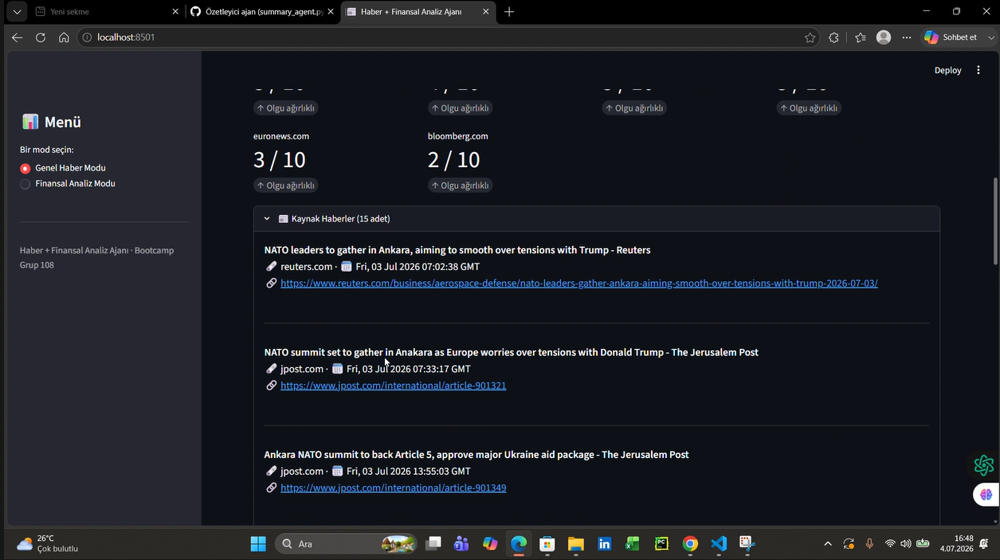
  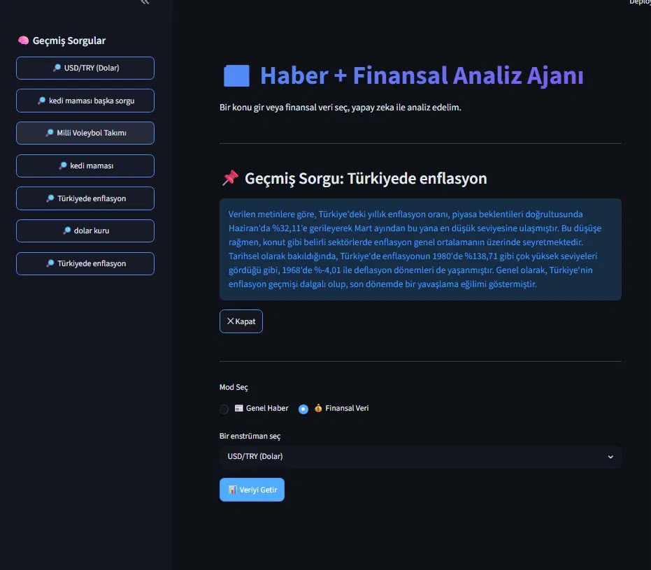
  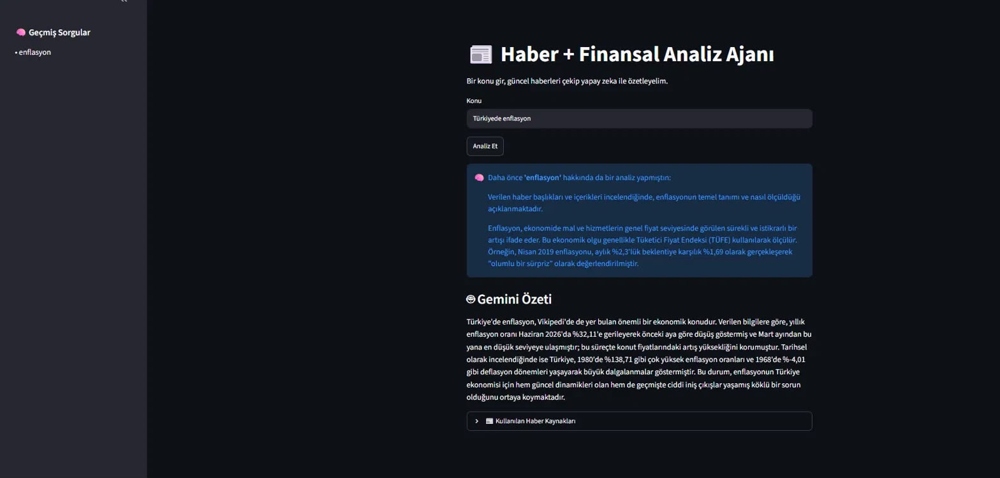

- **Sprint Review:**
  Sprint 1'de ekip, Genel Haber Modu'nun çekirdek akışı üzerinde iki paralel yaklaşımla
  ilerlemiştir. Bir yandan Tavily ve Gemini API'leri kullanılarak konu girişinden özet
  üretimine kadar uçtan uca çalışan bir prototip geliştirilmiş; diğer yandan projenin uzun
  vadeli mimarisine uygun, modüler bir yapı kurulmuştur: mod seçici arayüz, PRD'ye uygun
  şekilde 5-15 kaynak sınırlı ve gün aralığı filtreli bir haber toplama modülü, ve Claude API
  ile hem TL;DR özeti hem de her kaynağı olgu/yorum ekseninde 1-10 arası puanlayan bir bias
  analizi üreten bir özetleme modülü. Bu ikinci yaklaşım test edilmiş ve uçtan uca çalışır
  durumda olduğu doğrulanmıştır.

  Alınan kararlar: İki farklı yapay zeka sağlayıcısının (Gemini ve Claude) paralel
  kullanılmasının karışıklık yarattığı görülmüş, Sprint 2 başında tek bir sağlayıcıya karar
  verilmesine ve iki yaklaşımın tek bir ana akışta birleştirilmesine karar verilmiştir. Kaynak
  kartlarının (başlık, kısa AI özeti, kaynak, tarih, link) görsel kart tasarımı henüz
  yapılmadığı için bu story bir sonraki sprint'e aktarılmıştır. Çıkan prototiplerin ikisinde de
  temel işlevsellikte bir problem gözlemlenmemiştir.

  Sprint Review katılımcıları: Tüm takım.

- **Sprint Retrospective:**
  - Paralel ilerleyen iki yaklaşımın Sprint 2 başında tek bir ortak yapıda birleştirilmesine
    karar verilmiştir.
  - Sprint 2'de görev dağılımının ve ilerleme takibinin daha net ve düzenli şekilde
    yürütülmesine karar verilmiştir.

---
# Sprint 2

**Sprint Süresi:** 6 Temmuz 2026 – 19 Temmuz 2026

- **Backlog düzeni ve Story seçimleri:** Sprint 2'nin odağı Finansal Analiz Modu'nun
  tamamı, kullanıcı hesabı/kişiselleştirme katmanı ve uzun vadeli hafıza sistemiydi.
  Kapsama alınan story'ler: varlık seçimi, fiyat verisi ve teknik göstergeler, finansal
  haber akışı, piyasa duygu analizi, sade dil özeti, fiyat alarmları, portföy takibi,
  piyasa takvimi, hesap/giriş sistemi, favori kaydetme, oturum ve kullanıcı tercih
  hafızası. Ayrıca Sprint 1'den devreden Bakış Açısı Haritası (bias analizi) da bu
  sprint'te tamamlandı. Dışa aktarma, uygulama içi not alma, sorgu cache'i, konu/haber
  alarmları ve mobil uyumluluk kapsam dışı bırakılıp backlog'da bekletildi. Backlog
  kolonu ve genel board görünümü:
  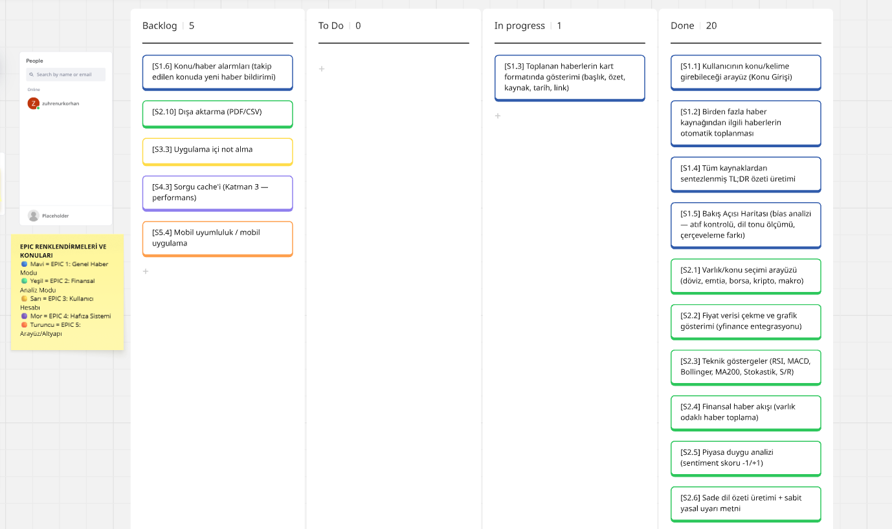
  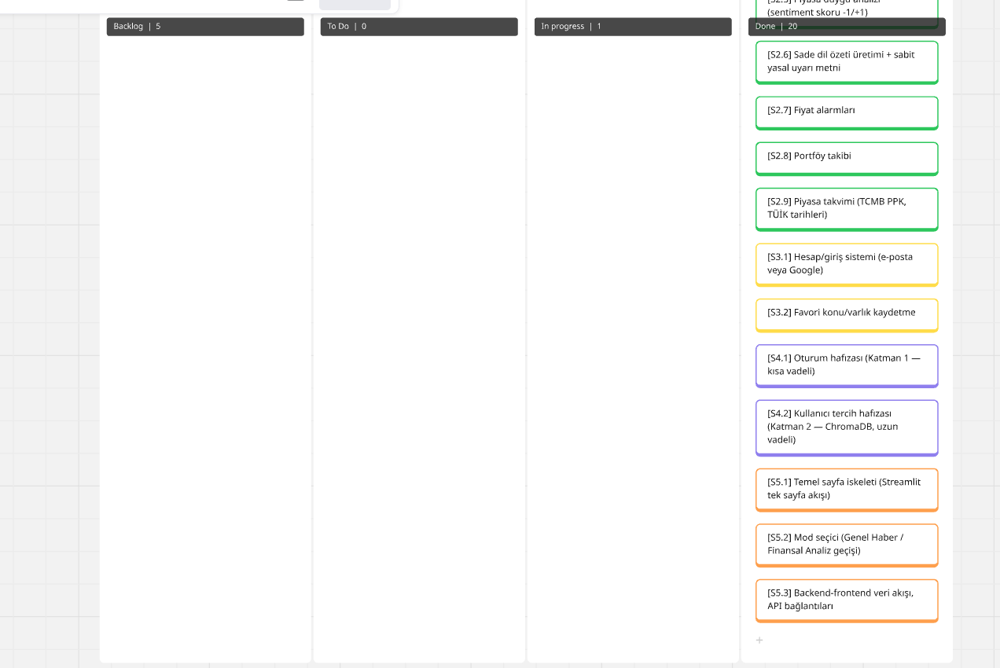

- **Daily Scrum:** Sprint 1'de olduğu gibi, toplantılar haftada 1-2 kez WhatsApp üzerinden
  yazılı check-in şeklinde sürdürüldü.

- **Sprint board update:** Board'un genel görünümü yukarıdaki görsellerde yer almaktadır.

- **Ürün Durumu:** Ekran görüntüleri:
  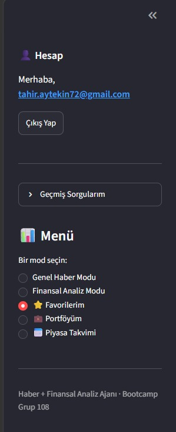
  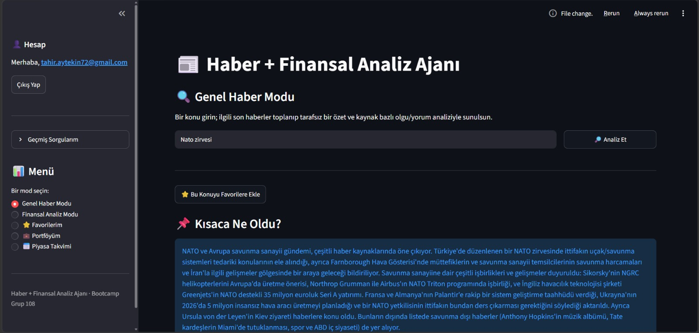
  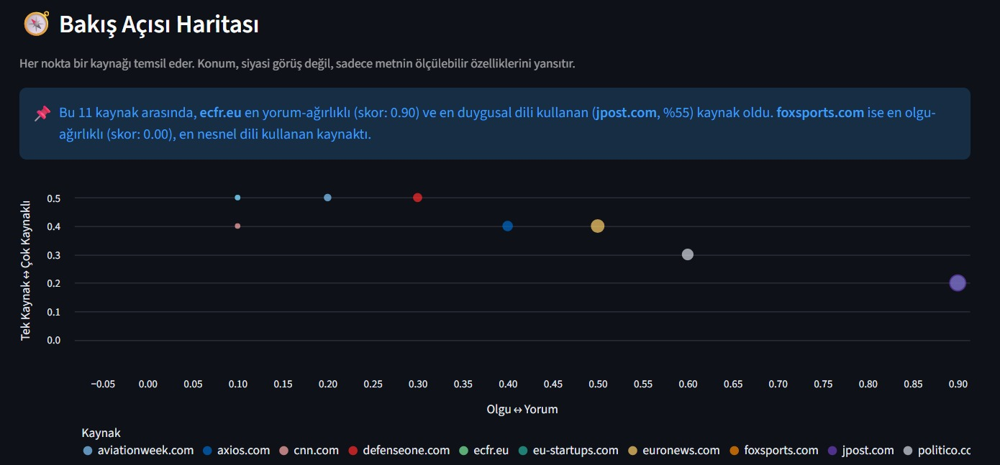
  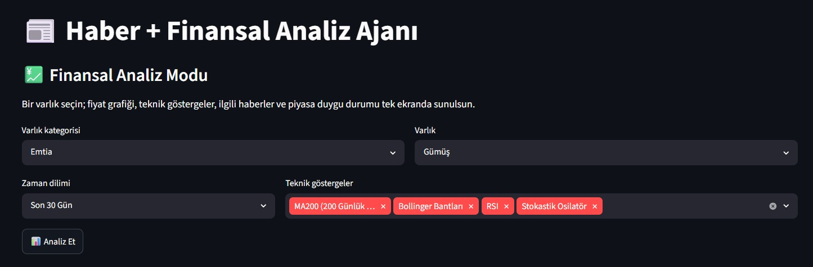
  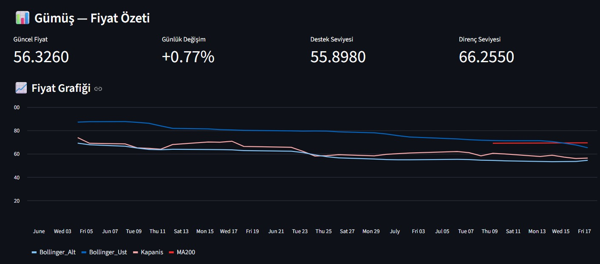
  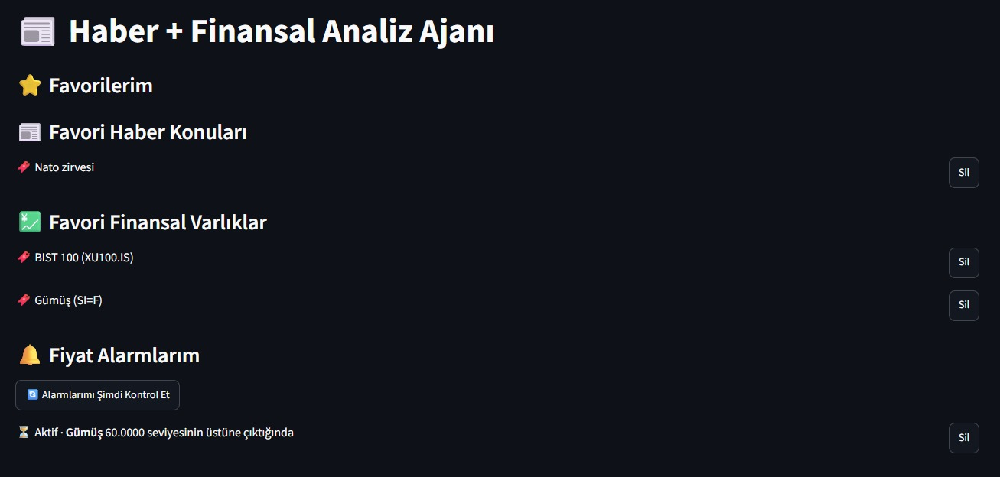
  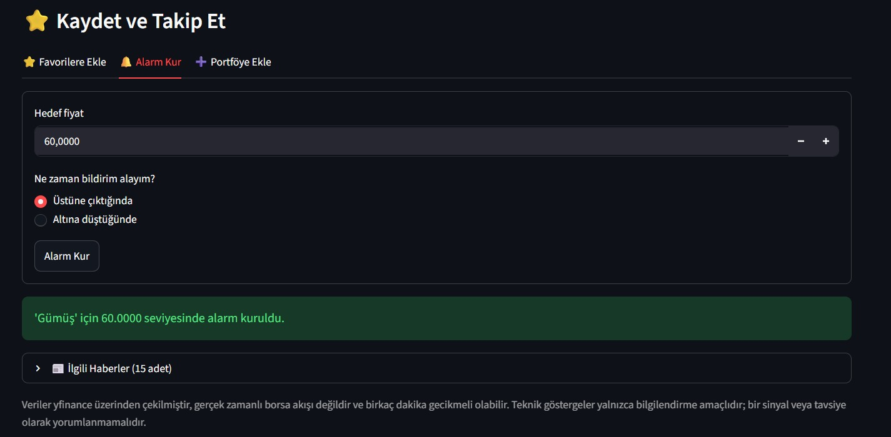
  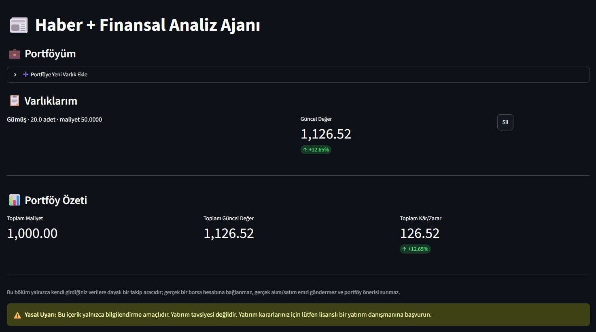
  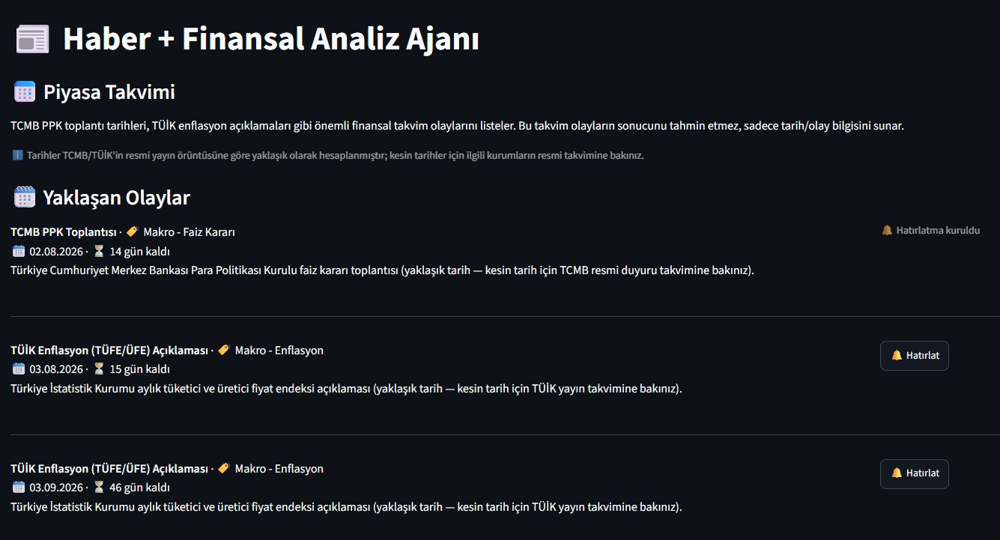

- **Sprint Review:**
  Sprint 2'de Finansal Analiz Modu uçtan uca tamamlandı: varlık kategorisi/varlık
  seçimi, zaman dilimi ve teknik gösterge (RSI, MACD, Bollinger Bantları, MA200,
  Stokastik Osilatör) seçenekleriyle fiyat grafiği, destek/direnç seviyeleri, varlık
  odaklı haber akışı ve piyasa duygu skoru tek ekranda birleştirildi; sabit yasal uyarı
  metni her finansal ekranın altında sabit olarak yer alıyor. Kullanıcı hesabı (e-posta
  ile kayıt/giriş, şifreler hashlenerek saklanıyor) ve buna bağlı favori, fiyat alarmı
  ve portföy takibi özellikleri de tamamlandı; portföy ekranı güncel fiyatlarla kâr/zarar
  hesaplıyor. Piyasa takvimi TCMB PPK ve TÜİK enflasyon açıklamaları için yaklaşık
  tarihler üretiyor ve hatırlatma kurulmasına izin veriyor — kesin tarihlerin ilgili
  kurumların resmi takviminden girilmesi gerektiği not edildi. Ayrıca Sprint 1'den
  devreden Bakış Açısı Haritası, dört ölçülebilir metrikle (olgu/yorum skoru,
  doğrulama skoru, atıf türü, duygusal yüzde) ve iki eksenli bir görselle tamamlandı.

  Alınan kararlar: Kaynakların "kart" formatında (ayrı kutular, favori/not ikonları)
  gösterimi hâlâ tamamlanmadı, bu story bir sonraki sprint'e aktarıldı. Dışa aktarma,
  uygulama içi not alma, sorgu cache'i, konu/haber alarmları ve mobil uyumluluk henüz
  ele alınmadı, backlog'da bekliyor. Geliştirilen kodun ana branch'e (main) taşınmasının
  Sprint 3'ün ilk işi olmasına karar verildi.

  Sprint Review katılımcıları: Tüm takım.

- **Sprint Retrospective:**
  - Bu sprint'te kapsamın büyük bölümü tamamlandı; kalan story'lerin sınırlı sayıda ve
    net olması Sprint 3'ün planlanmasını kolaylaştırıyor.
  - Board güncellemesinin sprint ortasında da düzenli kontrol edilmesine karar verildi.
  - Sprint 3'te öncelik geliştirilen kodun ana branch'e taşınması ve kaynak kartı
    tasarımının tamamlanması olacak.

---

# Sprint 3
