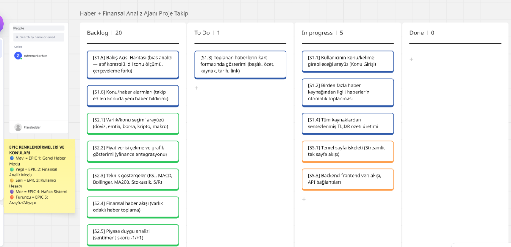
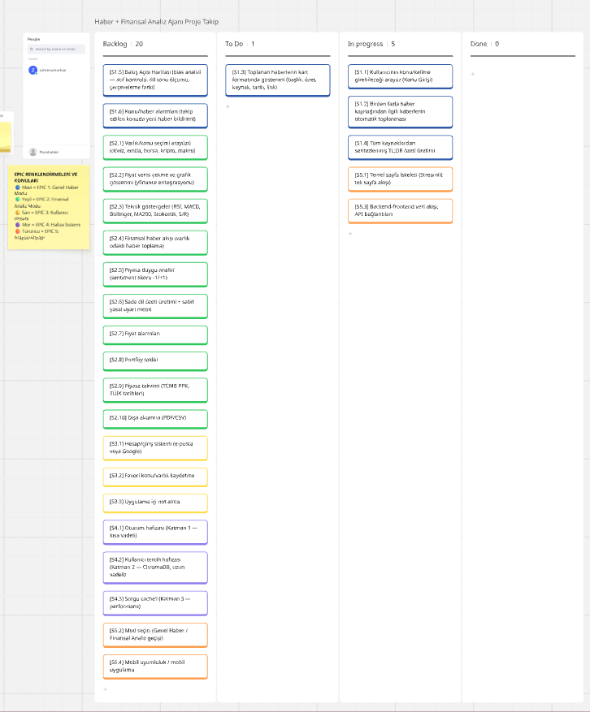
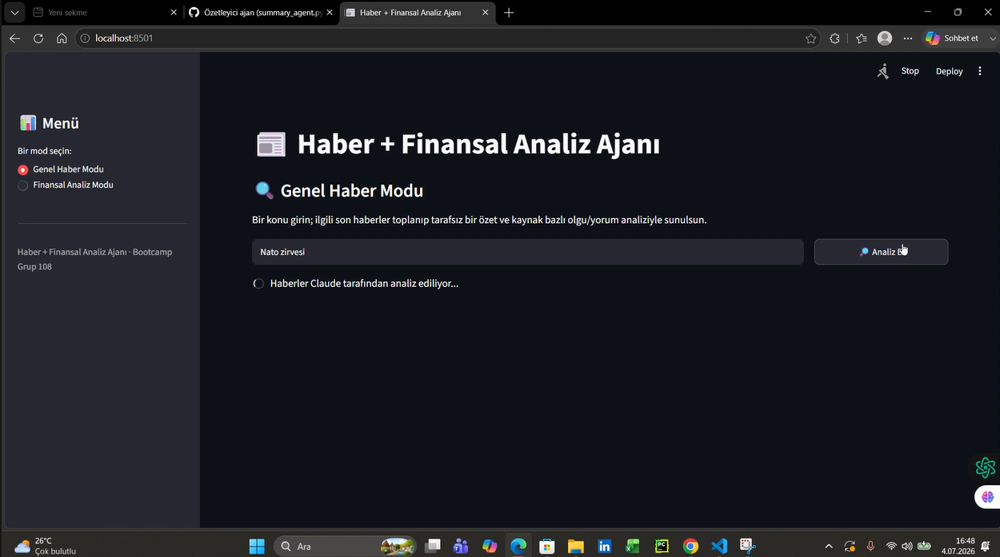
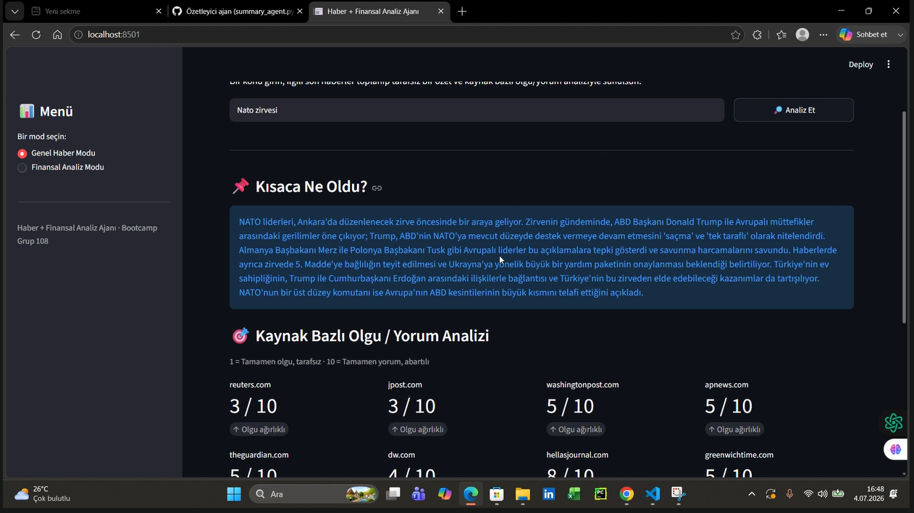

# Bootcamp-Grup108

## Takım Elemanları
- Orçun Kabay: Product Owner
- Zühre Nur Korhan: Scrum Master
- Sıla Öztürk: Developer
- Tahir Aytekin: Developer
- Ayşe Nur Şimşek: Developer

## Ürün İsmi
Haber + Finansal Analiz Ajanı

## Ürün Açıklaması
Kullanıcı bir konu veya finansal varlık girer. Sistem birden fazla
kaynaktan haber toplar, özetler, kaynaklar arası bakış açısı
farklılıklarını analiz eder. Finansal modda fiyat verisi ve piyasa
duygu analizi de sunulur.

## Ürün Özellikleri
- Çoklu kaynaktan otomatik haber toplama
- Yapay zeka ile haber özetleme
- Kaynak bazlı bias (bakış açısı) analizi
- Finansal varlık fiyat grafiği
- Piyasa duygu skoru (sentiment analizi)
- Oturum hafızası ile bağlam kurma

## Hedef Kitle
- Güncel haberleri takip eden genel kullanıcılar
- Bireysel yatırımcılar
- Finansal okuryazarlığını geliştirmek isteyen gençler

## Kullanılan Teknolojiler
Python, LangGraph, Tavily API, NewsAPI,
Gemini API, ChromaDB, Streamlit, Render.com

## Product Backlog
[Sprint 1 Miro Board](https://miro.com/welcomeonboard/RktwR1FoL0lQdnV6dG0zSzU0SUNlaGUrWHJRWnJkU2ErTnVaYWJDR0xjNTVMVkFVSDhXRFpMWDlhNEtXQXNMZU1RMmpUS01BOTdsTjRnbmtlYis2czZxVkRqa2VVektxdUlOM2c0MllPZmYxSGpVS3lsaEFvOFZGckYreUZGaEVBS2NFMDFkcUNFSnM0d3FEN050ekl3PT0hdjE=?share_link_id=980797653059)

---

# Sprint 1

**Sprint Süresi:** 19 Haziran 2026 – 5 Temmuz 2026

- **Backlog düzeni ve Story seçimleri:** Backlog, ürünün çekirdek değerini en hızlı sunacak
  story'lere göre önceliklendirilmiştir. Sprint 1 kapsamına Genel Haber Modu'nun temel akışı
  (konu girişi, haber toplama, kaynak kartları, TL;DR özeti) ve temel sayfa iskeleti alınmıştır.
  Finansal Analiz Modu, bias analizi, kullanıcı hesabı ve hafıza sistemi gibi daha kapsamlı
  özellikler sonraki sprint'lere bırakılmıştır. Story'ler task'lere bölünmüş; Miro board'da
  mavi kartlar Epic 1 (Genel Haber Modu), yeşil kartlar Epic 2 (Finansal Analiz Modu), sarı
  kartlar Epic 3 (Kullanıcı Hesabı), mor kartlar Epic 4 (Hafıza Sistemi), turuncu kartlar
  Epic 5 (Arayüz/Altyapı) olarak renklendirilmiştir. Backlog kolonu ekran görüntüleri:
  
  

- **Daily Scrum:** Toplantılar zaman kısıtları nedeniyle her gün değil, haftada 1-2 kez Slack
  üzerinden yazılı check-in şeklinde yapılmıştır. Ekip üyeleri o gün yaptıkları işi ve varsa
  engelleri kısaca paylaşmıştır.

- **Sprint board update:** Sprint board genel görünümü:
  

- **Ürün Durumu:** Ekran görüntüleri:
  
  

- **Sprint Review:**
  Sprint 1'de ekip, Genel Haber Modu'nun çekirdek akışı üzerinde iki paralel yaklaşımla
  ilerlemiştir. Bir yandan Tavily ve Gemini API'leri kullanılarak konu girişinden özet
  üretimine kadar uçtan uca çalışan bir prototip geliştirilmiş; diğer yandan projenin uzun
  vadeli mimarisine uygun, modüler bir yapı kurulmuştur: mod seçici arayüz, PRD'ye uygun
  şekilde 5-15 kaynak sınırlı ve gün aralığı filtreli bir haber toplama modülü, ve Claude API
  ile hem TL;DR özeti hem de embriyonik bir bias (olgu/yorum) puanlaması üreten bir özetleme
  modülü.

  Alınan kararlar: İki farklı yapay zeka sağlayıcısının (Gemini ve Claude) paralel
  kullanılmasının karışıklık yarattığı görülmüş, Sprint 2 başında tek bir sağlayıcıya karar
  verilmesine ve iki yaklaşımın tek bir ana akışta birleştirilmesine karar verilmiştir. Kaynak
  kartlarının (başlık, kısa AI özeti, kaynak, tarih, link) görsel kart tasarımı henüz
  yapılmadığı için bu story bir sonraki sprint'e aktarılmıştır. Çıkan prototiplerin ikisinde de
  temel işlevsellikte bir problem gözlemlenmemiştir.

  Sprint Review katılımcıları: Tüm takım.

- **Sprint Retrospective:**
  - Paralel ilerleyen iki yaklaşımın Sprint 2 başında tek bir ortak yapıda birleştirilmesine
    karar verilmiştir.
  - Sprint 2'de görev dağılımının ve ilerleme takibinin daha net ve düzenli şekilde
    yürütülmesine karar verilmiştir.

---

# Sprint 2

---

# Sprint 3